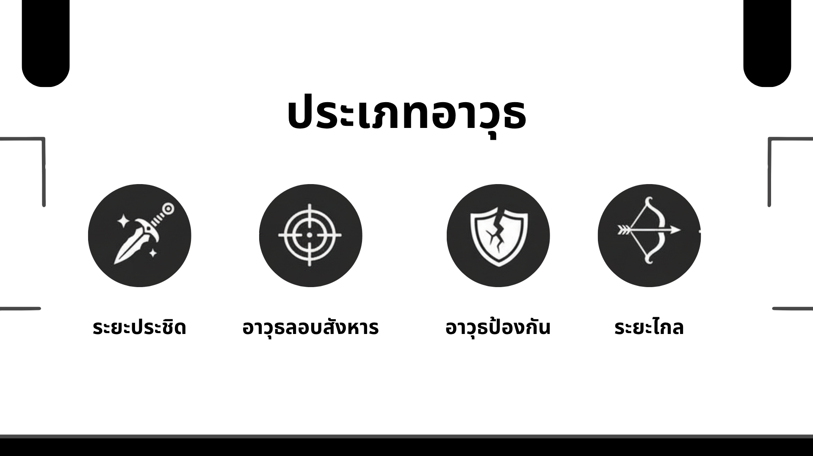
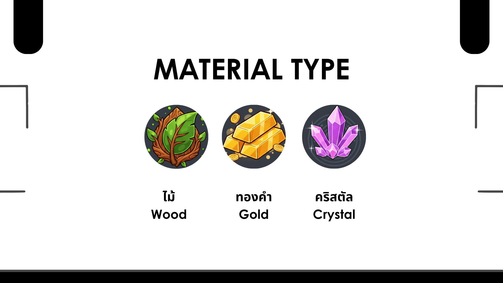
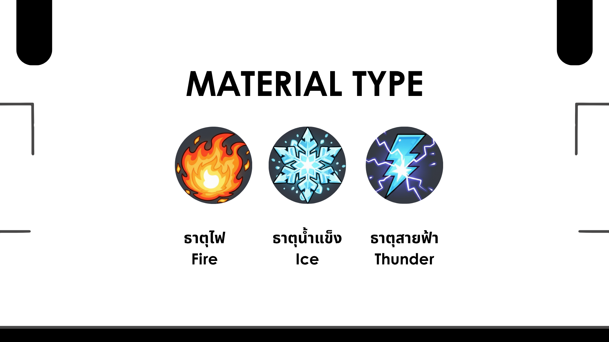
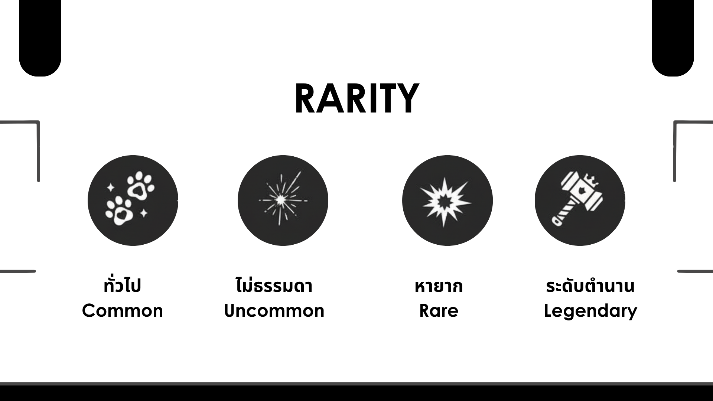
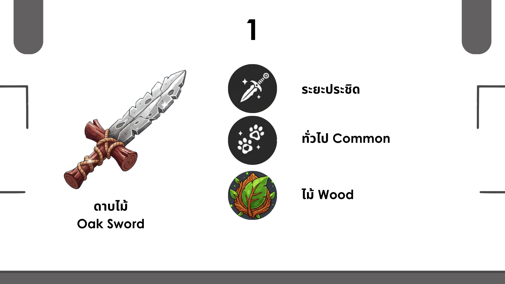
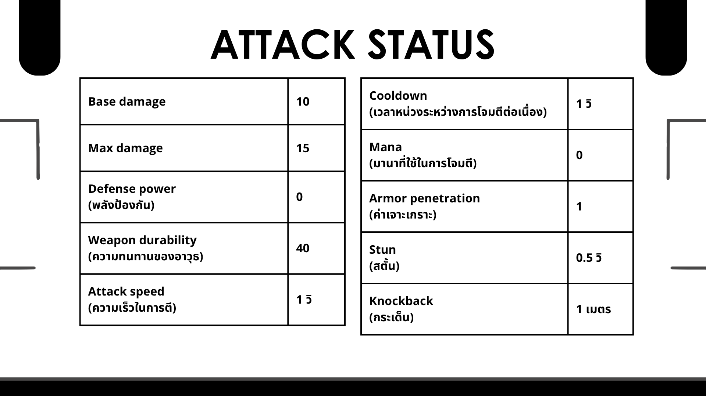
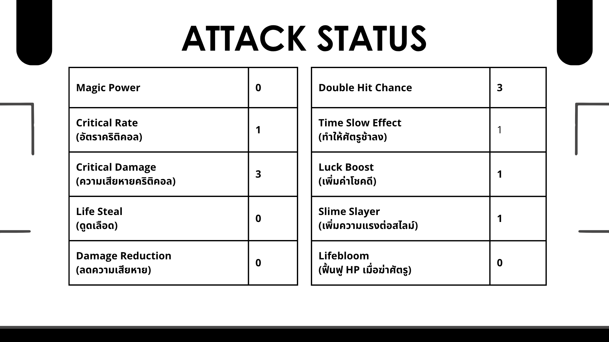
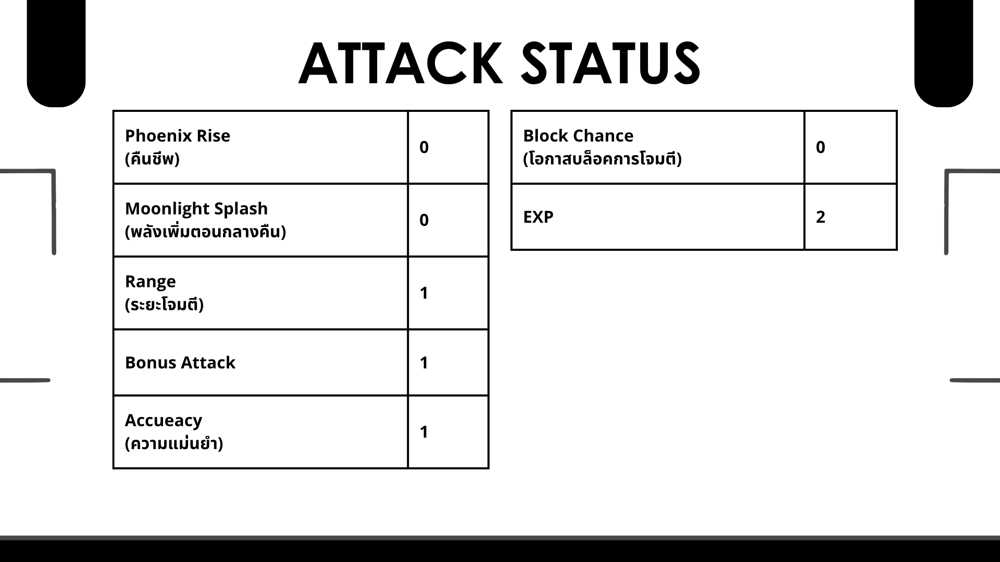

# Weapon Database & Systems
การออกแบบฐานข้อมูลเกม โดยทำโครงสร้างตารางข้อมูลอาวุธใน Google Sheets เพื่อใช้เป็นฐานข้อมูลหลักในการจัดเก็บค่า Stats และคุณสมบัติต่างๆ ของอาวุธภายในเกม Light The Way

# Project Overview
- **ออกแบบโครงสร้าง Data Schema:** วางระบบฐานข้อมูลอาวุธสำหรับเกม Light The Way จัดหมวดหมู่คุณสมบัติอย่างเป็นระบบตาม Weapon Type, Material และ Rarity Level เพื่อรองรับการบริหารจัดการ Game Balance
  > Weapon Type 
  > Material  
  > Rarity Level 
# ตัวอย่างข้อมูล

- **เขียน C# Script** ดึงข้อมูลแบบ Real-time จาก Google Sheets เข้าสู่ Unity ช่วยให้ฝ่าย Game Design สามารถปรับแก้ค่า Stats / Balance ได้
- **พัฒนาระบบ UI** รองรับ Data Parsing ดึงรูปภาพ คุณสมบัติ และรายละเอียดอาวุธจากฐานข้อมูลมาแสดงผลผ่าน ScrollView ใน Unity ได้

# Link
- [Video Showcase](https://youtu.be/s6hbu8njy3k?si=bBVVU3isD9AHl6Jz)
